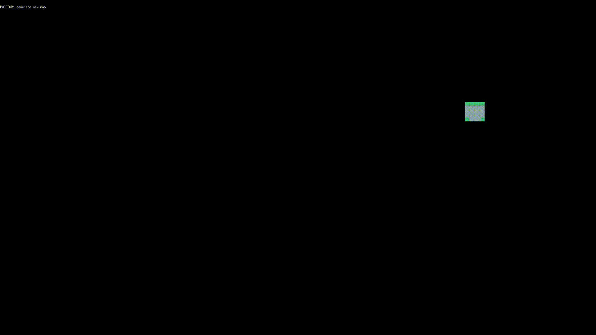

# go-wave-function-collapse

Wave function collapse algorithm, implemented in [Go](https://golang.org), with [ebiten](https://github.com/hajimehoshi/ebiten) game library.



## Usage

```go run main.go```

Use spacebar to generate a new map.

## Credits

- Algorithm inspired by [The Coding Train](https://thecodingtrain.com/challenges/171-wave-function-collapse)
- Spritesheet by [Kenney](https://kenney.nl)
